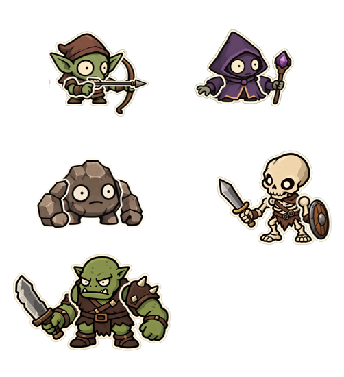
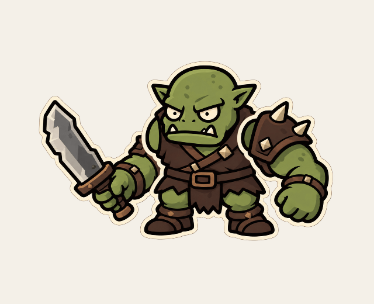
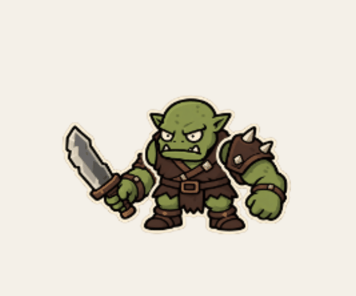

# 몬스터 스티커 제작·파츠 조립·애니메이션 공용 설명서

작성 기준일: 2026-10-08

이 문서는 현재 `assets/stickers`의 원본 이미지, `guide.png`, `설명서.pptx`와 사용자 확인을 마친 오크·골렘·고블린·스켈레톤·마법사 파츠 및 GIF를 기준으로 한다. 새 스티커 제작부터 파츠 분리, 조립, 애니메이션 확인까지 같은 절차로 작업하기 위한 설명서다.

**기준 자세는 가이드에 맞춘다. 파츠의 겹침 순서와 캐릭터 중심을 유지하고, 고정된 관절을 기준으로 움직인다.**

## 1. 현재 확인한 자료와 범위

| 자료 | 역할 |
| --- | --- |
| `guide.png` | 5종 몬스터의 조립된 기본 자세를 눈으로 비교하는 기준 |
| `설명서.pptx` | 파츠의 크롭 범위, 위치, 크기, 겹침 순서가 저장된 원본 조립 자료 |
| 각 몬스터의 PNG | 실제로 잘라 사용해야 하는 원본 그림 |
| `examples/orc-idle.gif` | 조립한 오크의 대기 동작 확인 예시 |
| `examples/orc-attack.gif` | 중심을 고정하고 몸체 반동과 반대쪽 팔 움직임을 추가한 오크 공격 예시 |
| `examples/golem-attack.gif` | 승인한 돌덩이 팔을 같은 방향으로 들어 올렸다가 내려찍는 골렘 공격 예시 |
| `examples/goblin-attack.gif` | 팔의 앞뒤를 바로잡고 손·시위·화살을 연결한 고블린 궁수 공격 예시 |
| `examples/skeleton-attack.gif` | 중심을 고정하고 검을 들어 올렸다가 아래로 베는 스켈레톤 공격 예시 |
| `examples/mage-attack.gif` | 지팡이를 든 손을 높이 올려 마력을 모은 뒤 내려서 발사하는 마법사 공격 예시 |

`설명서.pptx`는 1개 슬라이드, 16개 그림 개체로 구성되어 있다. 내부의 5종 파츠 이미지가 이 폴더의 PNG와 픽셀 단위로 일치하는 것을 확인했다. 조립할 때는 작은 가이드 그림만 보고 위치를 추측하기보다 PPTX의 배치 정보를 사용한다.

현재 확인 범위는 다음과 같다.

- 고블린·마법사·골렘·오크·스켈레톤: 가이드와 파츠 구성, 조립 위치 및 겹침 순서 확인.
- 슬라임·불 슬라임: 분리되지 않은 완성 PNG 확인.
- 오크: 대기 GIF와 공격 GIF 제작 후 사용자 확인. 마지막 공격 예시가 이 문서의 기준이다.
- 골렘: 양팔의 굽힘 방향과 크기, 돌덩이 형태의 끝부분을 수정한 정지 조립과 공격 GIF에 대해 사용자 확인을 마쳤다.
- 고블린: 활을 든 팔을 위로 살짝 기울이고 몸체 쪽으로 넣은 정지 조립과 시위 당기기·발사 GIF에 대해 사용자 확인을 마쳤다.
- 스켈레톤: 가이드에 맞춘 정지 조립과 검을 들어 올려 아래로 베는 공격 GIF에 대해 사용자 확인을 마쳤다.
- 마법사: 가이드에 맞춘 정지 조립과 지팡이를 든 손의 고점을 더 높인 공격 GIF에 대해 사용자 확인을 마쳤다.
- 오크·골렘·고블린·스켈레톤·마법사·슬라임·불 슬라임은 실제 게임의 준비 화면·전투에 적용했다. 적용 구조는 9절에 기록했다.

## 2. 파일 구성과 파츠 구분

```text
assets/stickers/
├─ 스티커_공용_설명서.md
├─ guide.png
├─ 설명서.pptx
├─ examples/
│  ├─ orc-idle.gif
│  ├─ orc-attack.gif
│  ├─ golem-attack.gif
│  ├─ goblin-attack.gif
│  ├─ skeleton-attack.gif
│  └─ mage-attack.gif
├─ goblin/goblin-parts.png
├─ mage/mage-parts.png
├─ golem/golem-parts.png
├─ orc/orc-parts.png
├─ skeleton/skeleton-parts.png
├─ slime/slime.png
└─ fireSlime/fireSlime.png
```

| 몬스터 | PNG 크기 | 이미지 안의 파츠 |
| --- | --- | --- |
| 고블린 | 1774 × 887 | 몸체, 활을 든 팔, 화살을 당기는 팔, 화살 |
| 마법사 | 1774 × 887 | 몸체, 펼친 손의 팔, 지팡이를 든 팔 |
| 골렘 | 2152 × 731 | 몸체, 양팔 |
| 오크 | 1774 × 887 | 몸체, 검을 든 팔, 어깨 갑옷이 있는 반대쪽 팔 |
| 스켈레톤 | 1774 × 887 | 몸체, 검을 든 팔, 방패를 든 팔 |
| 슬라임 | 1448 × 1086 | 완성 이미지 1개 |
| 불 슬라임 | 1272 × 1237 | 완성 이미지 1개 |

현재의 `*-parts.png`는 **PNG 한 장 안에 파츠가 떨어져 배치된 시트**다. 파츠별 PNG 파일이 이미 준비되어 있는 구조가 아니다. 위 크기는 현재 파일의 실측값이며, 모든 신규 스티커에 강제하는 공통 해상도는 아니다.

## 3. 스티커 제작 절차

### 3.1 기존 그림의 표현을 맞춘다

현재 에셋에서 확인되는 표현은 큰 머리와 짧은 몸, 굵은 어두운 외곽선, 크림색의 바깥 테두리, 면을 나누는 명암이다. 새 몬스터를 만들 때는 기존 몬스터와 나란히 놓고 체형, 얼굴 크기, 외곽선과 바깥 테두리가 어울리는지 확인한다.

머리와 다리는 현재 몸체 그림에 포함되어 있다. 팔만 분리된 캐릭터에서 머리나 다리가 독립적으로 움직이는 애니메이션은 원본 파츠 구성만으로 만들 수 없다.

### 3.2 완성 자세를 정하고 움직일 부위를 분리한다

1. 몸체와 무기가 보이는 기본 자세를 만든다.
2. 그 자세에서 별도로 움직일 팔과 소품을 구분한다.
3. 손과 손에 든 무기가 한 파츠인 경우, 손과 무기를 함께 움직이는 단위로 취급한다.
4. 분리된 파츠를 다시 겹쳤을 때 기본 자세가 재현되는지 확인한다.
5. 완성 자세를 `guide.png`처럼 비교할 수 있는 그림으로 남긴다.
6. 조립 원본에는 파츠별 크롭 범위, 배치 위치와 크기, 뒤에서 앞으로 그리는 순서를 남긴다.

고블린의 화살은 팔과 독립된 파츠다. 오크·스켈레톤의 검과 마법사의 지팡이는 해당 팔 그림에 포함되어 있다. 캐릭터마다 소품 분리 방식이 다르므로, 모든 무기를 독립 파츠로 가정하지 않는다.

### 3.3 투명 배경과 접합부를 확인한다

- 게임에 사용할 원본은 알파 채널이 있는 PNG로 준비한다. 현재 7종 원본에서 투명 영역을 확인했다.
- 파츠 사이에 충분한 빈 공간을 두어 크롭 범위를 구분할 수 있게 한다.
- 몸체에 가려지는 팔의 끝과 흰 테두리가 기본 자세에서 어떻게 겹치는지 확인한다.
- 실제로 사용할 회전 범위에서도 접합부에 빈틈이 생기지 않는지 확인한다.
- 크롭 영역에 들어온 다른 파츠의 조각과 떨어진 잔여 픽셀은 사용용 사본에서 정리한다.

현재 원본에는 흰색·빨강·노랑의 작은 흔적과 일부 인접 파츠의 조각이 있다. 이번 오크 미리보기는 파츠별로 가장 큰 연결된 비투명 영역(알파값 > 0)을 남겨, 분리된 잔여 픽셀을 제거했다. 이 방법을 다른 몬스터에 그대로 적용하기 전에 필요한 소품까지 삭제되지 않는지 확인한다. 특히 독립된 화살은 별도로 크롭해서 보존한다.

원본 PNG는 그대로 보관하고, 잘라낸 파츠와 미리보기는 별도 결과물로 만든다.

## 4. 가이드에서 조립 정보를 읽는 방법



### 4.1 좌표의 의미

| 정보 | 의미 |
| --- | --- |
| 원본 크롭 범위 | 원본 PNG에서 사용할 영역 |
| 조립 위치 `x, y` | 잘라낸 파츠를 조립 좌표계에 놓는 위치 |
| 표시 크기 `w, h` | 조립 상태에서 그리는 파츠의 크기 |
| 레이어 순서 | 뒤에서 앞으로 그리는 순서 |
| 관절점 | 해당 파츠가 회전하는 기준점 |
| 캐릭터 중심 | 몸체 반동을 포함한 전체 회전의 고정 기준점 |

투명 여백도 크롭 범위에 포함되어 있다. 여백을 더 잘라낼 때는 그만큼 배치 위치와 관절 좌표도 함께 보정해야 한다. 흰 테두리만 보고 파츠를 자동 중앙 정렬하면 가이드와 다른 자세가 된다.

### 4.2 PPTX 정보 추출

PPTX는 ZIP 형식이다. 현재 설명서의 조립 정보는 다음 위치에서 읽을 수 있다.

```text
ppt/slides/slide1.xml               그림 개체와 그리는 순서
ppt/slides/_rels/slide1.xml.rels    그림 참조와 원본 이미지 연결
ppt/media/                        원본 이미지
```

그림 개체에서 `a:srcRect`는 크롭 비율, `a:xfrm/a:off`는 위치, `a:xfrm/a:ext`는 표시 크기다. 현재 설명서의 개체에는 별도 회전이나 반전 정보가 없으며, 파츠를 이동·크기 조정해서 조립했다.

`srcRect`의 값은 100000이 100%다. 원본 PNG의 가로·세로가 `W, H`일 때 다음과 같이 픽셀 범위로 바꾼다. 생략된 크롭 값은 0으로 취급한다.

```text
x0 = round(W × left / 100000)
y0 = round(H × top / 100000)
x1 = round(W × (1 - right / 100000))
y1 = round(H × (1 - bottom / 100000))

크롭 가로 = x1 - x0
크롭 세로 = y1 - y0
```

이 문서의 크롭 좌표는 `[x0, y0, x1, y1]`이며, 오른쪽·아래쪽 끝은 포함하지 않는다. 좌표를 픽셀로 반올림하면서 원본 개체의 비율과 미세한 차이가 생길 수 있으므로, 확대해서 경계를 확인한다.

PPTX 배치 좌표는 EMU 단위다. 게임에서 그대로 EMU를 사용할 필요는 없다. 캐릭터별로 가장 작은 `x, y`를 빼서 로컬 좌표로 옮기고, 위치와 크기에 공통 배율을 곱하면 된다.

```text
localX = (partX - minX) × scale
localY = (partY - minY) × scale
localW = partW × scale
localH = partH × scale
```

파츠의 크롭 데이터·배치 데이터·관절점·키프레임은 렌더링 로직과 구분해서 관리한다. 원본 그림의 크기가 바뀌면 이전 크롭 좌표를 그대로 재사용하지 않는다.

## 5. 기본 자세의 겹침 순서

아래의 좌우는 캐릭터의 해부학적 좌우가 아니라 **가이드 그림을 보는 사람 기준**이다. 표의 왼쪽에서 오른쪽 순서로 그린다.

| 몬스터 | 뒤에서 앞으로 그리는 순서 |
| --- | --- |
| 고블린 | 활을 든 팔 → 몸체 → 화살 → 화살을 당기는 팔 |
| 마법사 | 지팡이를 든 팔 → 몸체 → 펼친 손의 팔 |
| 골렘 | 그림 오른쪽 팔 → 몸체 → 그림 왼쪽 팔 |
| 오크 | 검을 든 팔 → 몸체 → 어깨 갑옷이 있는 반대쪽 팔 |
| 스켈레톤 | 검을 든 팔 → 몸체 → 방패를 든 팔 |

고블린은 화살을 당기는 손을 화살보다 나중에 그려야 손으로 화살을 잡고 있는 모습이 된다. 오크의 검을 든 팔은 공격 중에도 몸체 뒤에 둔다. 공격을 강조하기 위해 이 팔을 몸체 앞으로 바꿨던 미리보기는 사용자 확인 과정에서 제외했다.

## 6. 중심과 관절을 고정하는 애니메이션

### 6.1 고정할 것과 움직일 것을 구분한다

- 캐릭터의 기준 위치와 회전 중심은 고정한다.
- 모든 프레임은 같은 캔버스 크기와 같은 기준 위치를 사용한다.
- 팔은 손이나 칼끝이 아니라 어깨 관절을 기준으로 회전한다.
- 몸체의 작은 반동은 고정된 중심을 기준으로 회전시킨다.
- 팔의 관절점은 몸체와 같은 좌표계에 두어, 몸체 반동을 따라가게 한다.
- 파츠의 겹침 순서는 공격 도중에도 유지한다.

**중심 고정은 몸체를 완전히 정지시킨다는 뜻이 아니다.** 마지막 오크 예시에서는 캐릭터 중심의 위치를 유지하면서 몸체에 작은 회전 반동을 주고, 반대쪽 팔이 조금 늦게 따라 움직이게 했다.

무기가 움직이면 프레임마다 그림의 외곽 범위가 달라진다. 그 외곽 범위를 기준으로 매 프레임 다시 중앙 정렬하거나, 프레임별로 자동 크롭하면 캐릭터가 흔들려 이동하는 것처럼 보일 수 있다. 중심은 기본 자세에서 정한 기준점을 계속 사용한다.

### 6.2 기본 변환 순서

좌표축은 오른쪽이 `+x`, 아래쪽이 `+y`다. 아래 방식의 Canvas 회전에서는 양수가 시계 방향이다.

```text
캐릭터의 고정 중심으로 이동
몸체 반동 각도만큼 회전
로컬 원점으로 복귀

  파츠를 기본 레이어 순서대로 처리:
    해당 파츠의 관절점으로 이동
    파츠 각도만큼 회전
    파츠 원점으로 복귀
    원본 파츠 그리기
```

몸체, 두 팔이 이 변환 계층을 공유하면 몸체가 조금 회전해도 팔의 부착 위치가 함께 따라간다. 별도로 계산한 화면 좌표를 매 프레임 팔에 덮어쓰지 않는다.

현재 자료의 몸체는 머리·몸통·다리가 합쳐진 그림이다. 따라서 몸체 반동은 이 그림 전체에 적용된다. 큰 회전이나 가려진 면을 드러내는 동작은 파츠의 흰 테두리와 접합부를 실제 프레임에서 확인해야 한다.

## 7. 확인된 오크 예시

### 7.1 조립 데이터

원본은 `orc/orc-parts.png`, 크기는 1774 × 887이다. 아래 로컬 배치는 PPTX에서 오크의 가장 작은 `x, y`를 뺀 값이다. 위치와 크기의 단위는 EMU이며, 전체 조립 범위는 1952625 × 1365250이다.

| 순서 | 파츠 | 크롭 범위 `[x0,y0,x1,y1]` | 로컬 배치 `[x,y,w,h]` |
| --- | --- | --- | --- |
| 0 | 검을 든 팔 | `[0,0,651,887]` | `[0,50800,965200,1314450]` |
| 1 | 몸체 | `[651,0,1251,887]` | `[692150,0,889000,1314450]` |
| 2 | 반대쪽 팔 | `[1273,0,1774,887]` | `[1209675,0,742950,1314450]` |

관절 위치는 PPTX에서 지정된 값이 아니라, 오크 미리보기를 만들면서 설정한 값이다. 마지막 공격 예시에 사용한 값을 아래에 기록한다. 다른 몬스터의 공통 관절 위치로 사용하지 않는다.

| 기준점 | 해당 파츠의 표시 사각형 기준 비율 |
| --- | --- |
| 검을 든 팔의 어깨 | `x = 0.86, y = 0.45` |
| 반대쪽 팔의 어깨 | `x = 0.18, y = 0.43` |
| 캐릭터의 고정 중심 | 몸체 기준 `x = 0.45, y = 0.67` |

예를 들어 파츠의 로컬 배치가 `[x,y,w,h]`이고 관절 비율이 `[u,v]`라면 관절 좌표는 `[x+w×u, y+h×v]`다.

### 7.2 대기 예시



640 × 520, 48프레임, 프레임당 50ms, 2.4초 반복이다. 가이드의 배치 위에 작은 몸체 압축·이완과 양팔 회전을 넣은 조립 확인 예시다. 아래 공격 예시와는 미리보기 캔버스와 표시 배율이 다르므로, 두 GIF를 그대로 이어 붙이는 프레임 세트로 취급하지 않는다.

### 7.3 공격 예시



720 × 600, 프레임당 40ms 기준으로 56개 프레임을 렌더링한 2.24초 반복 예시다. 캐릭터 중심을 이동시키는 전진·후퇴나 크기 변경은 넣지 않았다. 검을 든 팔의 뒤쪽 레이어를 유지하면서, 고정된 중심을 기준으로 몸체의 작은 반동을 추가했다. 준비 동작에서 검을 든 팔을 120도까지 머리 뒤로 크게 젖혀 들었다가(이전 예시는 36도) 0.72~0.88초에 아래로 베어 내린다. 이때 몸체의 뒤로 젖힘(4.8도)과 반대쪽 팔의 목표 각도(-12도)도 함께 키웠다.

| 시간(초) | 검을 든 팔(도) | 몸체 반동(도) | 반대쪽 팔의 목표 각도(도) |
| --- | ---: | ---: | ---: |
| 0.00 | 0 | 0 | 0 |
| 0.28 | 0 | 0 | 0 |
| 0.72 | 120 | 4.8 | -12 |
| 0.88 | -32 | -2.0 | 6 |
| 1.00 | -29 | -1.2 | 4.5 |
| 1.14 | -17 | 0.6 | -2 |
| 1.32 | -6 | -0.35 | 1.5 |
| 1.52 | 0 | 0 | 0 |
| 2.24 | 0 | 0 | 0 |

반대쪽 팔은 위 목표 곡선을 0.06초 늦게 따라간다. 기본 보간은 `t² × (3 - 2t)`이고, 빠르게 베는 0.72~0.88초 구간은 `t²`를 사용했다. 준비, 빠른 베기, 짧은 유지, 반동, 복귀를 구분한 설정이다.

정지 프레임을 합치는 GIF 최적화 때문에 저장된 GIF는 34프레임이다. 재생 시간은 합쳐진 프레임의 지연 시간을 포함해 2.24초로 유지된다. 프레임 개수만으로 재생 속도를 판단하지 않는다.

## 8. 미리보기 제작과 확인

1. 원본 파츠를 기본 자세로 조립한 PNG부터 확인한다.
2. 가이드와 나란히 비교하고 파츠의 크기, 겹침, 발 위치를 맞춘다.
3. 대기 또는 공격 중 하나의 동작을 만든다.
4. 준비·공격·반동·복귀 시점의 정지 프레임을 확대해서 확인한다.
5. GIF로 저장해서 반복 재생을 확인한다.
6. 수정본은 이전 파일과 구분되는 이름으로 저장한다.

이번 미리보기는 원본 PNG의 파츠를 잘라 Canvas에서 합성하고, 각도를 적용해 렌더링한 방식이다. 원본 캐릭터를 새로 그리는 과정을 거치지 않았다.

GIF 확인 시 주의할 사항:

- 프레임별 지연 시간을 모두 설정한다. 첫 프레임만 설정하면 나머지 프레임이 너무 빠르게 재생될 수 있다.
- 동일한 정지 프레임은 하나로 합쳐질 수 있다. 전체 지연 시간의 합을 확인한다.
- 반복용 GIF에서는 마지막 자세와 첫 자세가 연결되는지 확인한다.
- 칼끝·팔·몸체가 캔버스 가장자리에서 잘리지 않게 확인한다.
- 투명 PNG 원본과 GIF의 제한된 색상 표현은 다르다. GIF는 움직임 확인용으로 사용하고 원본 PNG를 보존한다.

## 9. 현재 게임에 적용한 스티커

`index.html`의 `ASSETS.orc`는 `assets/stickers/orc/assembled.png`를 참조한다. 준비 화면의 `pic()`은 이 투명 배경의 조립 이미지를 사용하므로 가방·상점·정보창·도감·적 예고·전투 하단 아이콘에 함께 반영된다. 슬라임 계열은 아래 9.3절의 완성 이미지를 사용한다. 다른 몬스터의 이미지 경로는 기존대로 유지했다. 파츠 시트를 이미지 경로에 직접 넣으면 분리된 파츠 전체가 표시되므로 조립된 이미지와 구분한다.

전투의 `drawUnit()`은 오크에 대해 파츠를 합성한 프레임을 사용한다. 아군·적군·오크 보스가 같은 파츠를 사용하며, 기존 좌우 반전·속성 색상 필터·피격·사망·적 외곽선 처리를 이어서 적용한다. 크기와 발 기준은 기본 자세에서 한 번 정하며, 공격 프레임의 외곽 범위로 다시 계산하지 않는다.

| 파일 | 역할 |
| --- | --- |
| `orc/rig.js` | 원본 크롭, 레이어 순서, 배치, 관절점, 기본 경계와 동작 키프레임 데이터 |
| `orc/sword-arm.png`, `orc/body.png`, `orc/free-arm.png` | 잔여 픽셀을 제거한 사용용 파츠 |
| `orc/assembled.png` | 준비 화면과 각종 아이콘용 조립 이미지 |
| `../../scripts/sticker-renderer.js` | 게임의 전투 규칙을 참조하지 않고, 지정된 시간의 파츠를 합성하는 렌더러 |
| `../../tools/build-orc-sticker.cjs` | 원본 시트와 조립 데이터로 사용용 PNG를 다시 생성하는 도구 |

PNG 재생성 도구는 Node.js, `sharp`, `@napi-rs/canvas`가 필요하다. 게임 자체를 실행할 때는 이 도구나 해당 패키지가 필요하지 않다. 원본 시트는 수정하지 않는다. 원본이나 배치를 바꾸어 기본 자세의 경계가 달라졌다면 `rig.js`의 `neutralBounds`와 `uiBounds`도 새 결과에 맞춰 갱신한다.

### 9.1 공격 시점 연결

현재 근접 공격은 `simulate()`에서 공격 시작 시 피해를 적용하며 `u.swing`을 0.26초로 설정한다. 이를 유지하면서 다음과 같이 동작을 연결했다.

- 공격 직전 쿨다운의 마지막 0.32초: 승인한 동작의 0.28~0.88초 구간을 사용해 검을 들고 벤다. 적이 사거리 안에 있고 이동 중이 아닐 때만 준비한다.
- 실제 공격 발생 시: 동작의 0.88초 타격 자세로 연결한다.
- 공격 후 0.26초: 동작의 0.88~1.60초 구간을 사용해 반동과 복귀를 마친다. 반대쪽 팔의 지연 움직임이 끝나도록 복귀 끝에 짧은 여유를 둔다.
- 공격 준비·공격 중: 오크에 기존 전체 이미지 전진·압축·이완 효과를 추가하지 않는다. 승인한 파츠 동작을 사용한다.

따라서 예시 GIF의 2.24초 반복을 게임에 그대로 재생하는 방식이 아니다. 게임의 공격 주기와 피해 시점에 연결한 동작이다. 전투 배속과 일시정지는 게임의 시간에 따라 함께 적용된다.

미리보기의 고정 중심은 그림을 움직이는 기준이며, 게임 안에서 유닛이 이동하는 좌표와는 구분한다. 이동과 피격 반응은 기존 처리를 유지한다. 공격에서 제거한 것은 불필요한 전진·후퇴와 프레임별 재정렬이다.

### 9.2 적용 확인

변경 전후의 동일한 난수 조건으로 1·3·4·8·12전 각 3회, 총 15회의 전투 결과를 비교해 승패·남은 체력·위치·전투 통계가 같은 것을 확인했다. 공격 프레임의 캔버스 잘림과 고정 기준점, 브라우저의 일시정지·2배속, `index.html` 파일 직접 실행을 확인했다.

### 9.3 파츠가 필요 없는 슬라임 계열

슬라임과 불 슬라임은 각각 완성 PNG 한 장으로 교체했다. 원본은 `slime/slime.png`, `fireSlime/fireSlime.png`에 보관하고, `../../tools/build-slime-stickers.cjs`로 주변의 분리된 잔여 픽셀과 투명 여백을 정리한 `slime/game.png`, `fireSlime/game.png`를 생성한다. 이 도구는 Node.js와 `sharp`가 필요하며 게임 실행에는 필요하지 않다.

게임용 이미지는 그림의 가로를 252픽셀로 맞춘 뒤 사방에 투명 여백 2픽셀을 둔다. 종횡비를 유지하므로 기본 슬라임은 256 × 181, 불 슬라임은 256 × 244다. 전투와 가방→전투 전개에서 같은 가시 너비·바닥 기준을 사용한다.

| 슬라임 속성 | 게임 이미지 |
| --- | --- |
| 기본·물·독·생명·역병·샘물 | `slime/game.png` |
| 화염·빙염·폭염 | `fireSlime/game.png` |

속성별 색상 필터, 이동 시 뛰기, 공격 시 압축·이완, 피격·사망·독 폭발 등 기존 동작과 전투 규칙을 유지했다. 9개 속성의 이미지 선택과 전투 렌더링, `index.html` 직접 실행을 확인했다.

### 9.4 돌덩이 팔 골렘

골렘의 원본 시트와 몸체는 보존하고, 사용자 확인을 마친 양팔 PNG를 사용한다. 양팔의 팔꿈치는 그림 기준 왼쪽으로 굽으며, 끝부분은 손가락이나 주먹 홈이 없는 돌덩이 형태다. 해부학적 왼팔은 화면 오른쪽의 뒤쪽 팔, 오른팔은 화면 왼쪽의 앞쪽 팔이다. 뒤쪽 팔의 크기는 앞쪽 팔의 96%이며, 기본 각도는 각각 -35°와 0°다. 위치·크기·관절은 승인한 정지 조립을 기준으로 한다.

| 파일 | 역할 |
| --- | --- |
| `golem/left-arm.png`, `golem/right-arm.png` | 사용자 확인을 마친 돌덩이 팔 파츠 |
| `golem/body.png` | 원본 시트에서 분리한 몸체 |
| `golem/rig.js` | 조립 위치·어깨 관절·고정 중심·대기·공격 동작 데이터 |
| `golem/assembled.png` | 가방·상점·도감·군단 표시용 기본 자세 |
| `examples/golem-attack.gif` | 사용자 확인을 마친 공격 미리보기 |
| `../../tools/build-golem-sticker.cjs` | 승인한 파츠와 조립 데이터로 UI 이미지와 경계 데이터를 재생성하는 도구 |

게임의 공용 `sticker-renderer.js`는 지정된 동작 필드와 파츠별 기본 각도를 읽는다. 골렘의 두 팔에는 동일한 `arms` 회전값을 적용하고, **뒤쪽 팔 → 몸체 → 앞쪽 팔** 순서를 모든 자세에서 유지한다. 몸체의 반동은 고정 중심 주변의 작은 가로·세로 변형이며, 어깨 접합부도 함께 움직인다. 이미지 전체를 공격 방향으로 전진시키는 기존 효과는 골렘의 파츠 공격 중 적용하지 않는다. 이동·피격·사망 처리는 기존 게임 동작을 유지한다.

공격 직전 쿨다운 마지막 0.60초에 승인한 동작의 0.24~1.32초 준비·내려찍기 구간을 연결한다. 실제 공격 발생 때 1.32초 타격 자세를 표시하고, 기존 `u.swing` 0.26초 동안 1.32~1.96초 반동·복귀를 재생한다. 타격 시점에는 양팔 아래에 먼지와 충격선을 표시한다. 피해·공격 주기·범위·전투 규칙은 `simulate()`의 기존 처리를 사용하며, 애니메이션은 해당 게임 시간에 따라 일시정지·배속과 함께 작동한다.

아군·적군·12전 거신 골렘, 준비 화면 및 가방→전투 전개에 같은 이미지·크기·바닥 기준을 적용했다. 변경 전후 같은 난수 조건의 1·4·9·12전 각 3회, 총 12회 전투에서 승패·체력·위치·통계가 같은 것을 확인했다. 공격 프레임의 고정 기준점·잘림 없음, 이동·사거리 밖 준비 동작 제외, 일시정지·2배속, `index.html` 파일 직접 실행도 확인했다. 공용 렌더러 변경 후 기존 오크 검증 15회도 통과했다.

### 9.5 시위를 당기는 고블린 궁수

승인한 기본 자세는 가이드 배치에서 활을 든 팔을 어깨 기준 -8° 회전하고, 720 × 620 미리보기 좌표에서 몸체 쪽으로 10픽셀 옮긴 상태다. 몸체의 원래 크롭은 귀 끝을 자르므로 왼쪽을 531에서 499픽셀까지 넓혔으며, 기존 몸체 픽셀의 위치와 크기는 유지했다. 원본 시트와 PPTX는 수정하지 않았다.

| 파일 | 역할 |
| --- | --- |
| `goblin/bow-arm.png` | 활과 활을 든 팔 |
| `goblin/body.png` | 귀 끝까지 포함한 몸체 |
| `goblin/arrow.png` | 장전된 화살 |
| `goblin/drawing-arm.png` | 몸체 앞에서 시위를 당기는 팔 |
| `goblin/rig.js` | 승인한 조립 위치·어깨 관절·손 접점·시위·동작 데이터 |
| `goblin/assembled.png` | 가방·상점·도감·군단 표시용 기본 자세 |
| `examples/goblin-attack.gif` | 사용자 확인을 마친 1.92초 공격 미리보기 |
| `../../scripts/archer-composer.js` | 팔의 접힘·시위·장전된 화살을 조립하는 모듈 |
| `../../tools/build-goblin-sticker.cjs` | 게임과 같은 조립 모듈로 UI 이미지와 경계를 재생성하는 도구 |

그리는 순서는 **활을 든 팔 → 몸체 → 시위 → 화살 → 당기는 팔**이다. 당기는 팔의 어깨와 손 부분은 원래 크기를 유지하고, 둘 사이의 팔 구간을 변형해 손이 얼굴 쪽으로 당겨지는 느낌을 만든다. 조준 자세를 잠깐 유지하고, 발사 직후 손이 잠시 뒤에 남았다가 복귀한다. 시위는 활 양끝과 손 접점을 연결하며 발사 시 곧게 돌아와 짧게 떨린다. 캐릭터 중심과 레이어 순서는 모든 자세에서 유지한다.

공용 렌더러에는 선택적인 조립 함수를 넘긴다. 고블린의 조립 함수는 파츠와 지정된 시간만 참조하고, 게임 유닛·피해·공격 규칙은 참조하지 않는다. 오크·골렘은 기존 기본 조립 처리를 사용한다. 골렘과 달리 활의 아래쪽이 발보다 내려가므로, 고블린의 배치 기준은 전체 이미지 아래끝이 아닌 몸체 발 위치다.

쿨다운의 마지막 0.40초에 미리보기 0.16~1.00초 준비·당기기·조준 구간을 연결한다. 실제 화살을 생성하면 발사 시간을 기록해 즉시 1.00초 자세를 표시하며, 0.26초 동안 1.00~1.84초 반동·복귀·재장전 구간을 재생한다. 일제 사격도 같은 화살 생성 경로를 사용하므로 일반 공격의 `u.swing`이 없어도 발사 동작이 표시된다. 일제 사격의 세 발·피해 배율 1.2·재사용 대기 3초와 일반 공격 주기는 기존 규칙을 유지한다.

발사 순간 장전된 화살 파츠를 숨겨 게임의 실제 화살로 이어지게 한다. 미리보기 GIF의 날아가는 화살을 유닛 그림에 중복해서 그리지 않는다. 게임 화살의 초기 표시 위치는 활을 잡은 손에 맞추고, 비행 초반의 표시 오프셋을 점차 줄인다. 판정용 화살 위치·속도·목표·명중 계산은 기존 값을 유지한다.

아군·적군 고블린, 준비 화면 및 가방→전투 전개에 같은 이미지·크기·발 기준을 적용했다. 변경 전후 같은 난수 조건의 1·4·9·12전 각 3회, 총 12회 전투에서 승패·체력·위치·통계가 같은 것을 확인했다. 기존 오크·골렘의 대기·공격 16개 프레임은 변경 전과 픽셀 단위로 일치했다. 일반 공격·일제 사격의 발사 시점, 장전 화살 숨김·재장전, 고정 중심·잘림 없음, 일시정지·2배속, `index.html` 파일 직접 실행도 확인했다.

### 9.6 검과 방패를 든 스켈레톤

원본 시트에서 분리한 검을 든 팔·몸체·방패를 든 팔을 승인한 가이드 좌표로 조립한다. 원본 PNG와 PPTX는 보존한다. 모든 자세에서 **검을 든 팔 → 몸체 → 방패를 든 팔** 순서를 유지하며, 양팔은 각 어깨를 축으로 회전한다. 검을 66° 들어 올려 잠깐 멈춘 뒤 -65°까지 베고, -71°의 작은 후속 동작을 거쳐 복귀한다. 방패와 몸체에는 작은 반동을 주며 몸체 중심을 고정한다.

| 파일 | 역할 |
| --- | --- |
| `skeleton/sword-arm.png`, `skeleton/body.png`, `skeleton/shield-arm.png` | 원본에서 분리한 승인 조립 파츠 |
| `skeleton/rig.js` | 조립 위치·어깨 관절·중심·발 기준·대기·공격 데이터 |
| `skeleton/assembled.png` | 가방·상점·도감·군단 표시용 기본 자세 |
| `examples/skeleton-attack.gif` | 사용자 확인을 마친 2.24초 공격 미리보기 |
| `../../tools/build-skeleton-sticker.cjs` | 승인한 파츠와 조립 데이터로 UI 이미지와 경계를 재생성하는 도구 |

기존 공용 렌더러를 그대로 사용한다. 쿨다운 마지막 0.40초에 미리보기의 0.16~0.92초 준비·베기 구간을 연결하고, 실제 피해 발생 때 0.92초 타격 자세를 표시한다. 기존 `u.swing` 0.26초 동안 0.92~1.60초 반동·복귀를 재생한다. 대기 중에는 작은 호흡과 팔 움직임을 표시한다. 공격 중 이미지 전체가 전진하거나 뛰는 효과는 공용 파츠 처리에 따라 제외하며, 이동·피격·사망 동작은 기존 처리를 사용한다. 배치 기준은 몸체의 발 위치다.

아군·적군·8전 해골왕과 준비 화면·가방에서 전투로 전개되는 화면에 적용했다. 같은 난수 조건의 1·4·8·12전 각 3회, 총 12회 전투에서 변경 전후 승패·체력·위치·통계가 일치했다. 실제 타격 시점, 아군 30%·해골왕 40%의 1회 부활, 고정 기준점과 공격 프레임의 잘림 없음, 일시정지·2배속, `index.html` 파일 직접 실행을 확인했다. 기존 오크·골렘·고블린의 대기·공격 24개 프레임은 변경 전과 픽셀 단위로 일치했다.

### 9.7 지팡이를 높이 들었다가 발사하는 마법사

원본 시트에서 지팡이를 든 팔·몸체·펼친 손의 팔을 분리하고, 가이드의 배치와 **지팡이를 든 팔 → 몸체 → 펼친 손의 팔** 순서를 유지한다. 원본 PNG와 PPTX는 보존했다. 사용자 확인을 마친 수정 모션은 지팡이를 든 팔을 어깨 기준 -35°까지 올리고 잠깐 유지한 뒤, 발사 때 +4°로 내리고 +6°의 작은 후속 동작을 거쳐 복귀한다. 펼친 손과 몸체의 작은 반동도 함께 사용하며 몸체 중심과 어깨 접합점을 유지한다.

| 파일 | 역할 |
| --- | --- |
| `mage/staff-arm.png`, `mage/body.png`, `mage/open-arm.png` | 원본에서 분리한 승인 조립 파츠 |
| `mage/rig.js` | 조립 위치·관절·발·중심·대기·공격·보석 접점·마력 효과 데이터 |
| `mage/assembled.png` | 가방·상점·도감·군단 표시용 기본 자세 |
| `examples/mage-attack.gif` | 사용자 확인을 마친 높은 준비 자세의 2.24초 공격 미리보기 |
| `../../scripts/mage-composer.js` | 파츠와 지정된 시간으로 마력 모으기·보석의 발사 섬광을 그리는 모듈 |
| `../../tools/build-mage-sticker.cjs` | 게임과 같은 조립 모듈로 UI 이미지와 경계를 재생성하는 도구 |

공용 렌더러는 그대로 사용하고 마법사 조립 함수만 추가했다. 조립 함수는 게임 유닛·피해·공격 판정을 참조하지 않는다. 팔의 회전에 따라 보석의 접점과 마력 효과가 함께 움직인다. 게임에서는 미리보기의 날아가는 마법탄을 유닛 그림에 중복해 그리지 않고, 마력 모으기와 발사 직후 보석 섬광만 표시한다.

쿨다운 마지막 0.48초에 미리보기의 0.16~0.96초 준비·내리기 구간을 연결한다. 실제 마법탄 생성 때 발사 시간을 기록해 즉시 0.96초 자세를 표시하고, 기존 0.26초 복귀 구간에 0.96~1.64초 모션을 연결한다. 마법탄은 표시 위치만 보석에 맞추고 첫 40픽셀 비행 동안 오프셋을 줄인다. 판정용 위치·속도·목표·수명은 기존 값을 유지한다. 고블린 화살과 마법탄은 같은 표시용 발사 경로를 사용하며 기존 화살 호출 함수도 유지한다.

아군·적군 마법사와 준비 화면·전투 전개에 같은 조립·발 기준을 적용했다. 같은 난수 조건의 1·6·8·12전 각 3회, 총 12회 전투에서 변경 전후 승패·체력·위치·통계가 일치했다. 승인한 공격 키프레임, 마력 모으기·발사 섬광과 효과 소멸, 양쪽 방향의 보석 발사 위치, 고정 기준점과 프레임 잘림 없음, 일시정지·2배속, `index.html` 파일 직접 실행을 확인했다. 기본 공격의 피해 35·주변 피해 19.25와 방벽의 8초 주기·최대 체력 20% 부여·40% 상한·5초 지속도 확인했다. 기존 오크·골렘·고블린·스켈레톤의 대기·공격 32개 프레임은 변경 전과 픽셀 단위로 일치했다.

## 10. 작업 완료 확인표

- [ ] 원본 PNG와 조립 가이드가 함께 있다.
- [ ] 파츠의 크롭 범위와 표시 크기를 확인했다.
- [ ] 몸체·팔·소품이 기본 자세에서 가이드와 맞는다.
- [ ] 다른 파츠의 조각과 떨어진 잔여 픽셀을 정리했다.
- [ ] 필요한 독립 소품과 흰 테두리는 남아 있다.
- [ ] 어깨 관절점과 캐릭터 중심을 지정했다.
- [ ] 공격 중에도 기본 레이어 순서를 유지한다.
- [ ] 캐릭터 중심을 매 프레임 이동·재정렬하지 않는다.
- [ ] 몸체 반동과 반대쪽 팔 움직임에서 접합부가 유지된다.
- [ ] 준비·공격·복귀의 주요 프레임을 확대해서 확인했다.
- [ ] 캔버스 잘림, 반복 연결, 전체 재생 시간을 확인했다.
- [ ] 원본과 구분되는 미리보기를 남겼다.
- [ ] 미리보기 확인과 실제 게임 적용 상태를 구분해서 기록했다.

## 부록. 현재 PPTX의 전체 조립 좌표

아래는 현재 원본에서 추출해 조립 확인에 사용한 값이다. `순서`는 각 몬스터 안에서의 뒤→앞 순서다. 배치 좌표는 슬라이드 기준 절대 EMU 값이며, 게임의 화면 픽셀 좌표가 아니다.

| 몬스터 | 순서 | 파츠 | 크롭 범위 `[x0,y0,x1,y1]` | 슬라이드 배치 `[x,y,w,h]` |
| --- | ---: | --- | --- | --- |
| 오크 | 0 | 검을 든 팔 | `[0,0,651,887]` | `[774700,3549650,965200,1314450]` |
| 오크 | 1 | 몸체 | `[651,0,1251,887]` | `[1466850,3498850,889000,1314450]` |
| 오크 | 2 | 반대쪽 팔 | `[1273,0,1774,887]` | `[1984375,3498850,742950,1314450]` |
| 골렘 | 0 | 그림 오른쪽 팔 | `[1511,0,2152,731]` | `[1860549,2584304,701675,800245]` |
| 골렘 | 1 | 몸체 | `[641,0,1523,731]` | `[1263650,2558905,965200,800245]` |
| 골렘 | 2 | 그림 왼쪽 팔 | `[0,0,641,731]` | `[906462,2584305,701675,800245]` |
| 고블린 | 0 | 활을 든 팔 | `[1251,0,1650,887]` | `[1846261,1133401,469901,1044575]` |
| 고블린 | 1 | 몸체 | `[531,0,1259,741]` | `[1263650,1139825,857250,873126]` |
| 고블린 | 2 | 화살 | `[572,733,1278,868]` | `[1608137,1655688,831850,158751]` |
| 고블린 | 3 | 화살을 당기는 팔 | `[191,402,596,650]` | `[1370013,1655688,476248,292100]` |
| 마법사 | 0 | 지팡이를 든 팔 | `[1182,0,1774,887]` | `[3473449,1144514,588960,882650]` |
| 마법사 | 1 | 몸체 | `[461,0,1201,887]` | `[3022598,1130301,736602,882650]` |
| 마법사 | 2 | 펼친 손의 팔 | `[0,429,453,887]` | `[2797172,1586670,450851,455538]` |
| 스켈레톤 | 0 | 검을 든 팔 | `[0,0,629,887]` | `[3021168,2498577,766605,1080330]` |
| 스켈레톤 | 1 | 몸체 | `[620,0,1197,887]` | `[3581399,2469320,701675,1080330]` |
| 스켈레톤 | 2 | 방패를 든 팔 | `[1244,0,1774,887]` | `[3975255,2483949,644914,1080330]` |

새 원본이나 새 조립 가이드로 교체하면 해당 원본에서 좌표를 다시 추출한다. 이 표는 현재 파일에 대응하는 기록이다.
